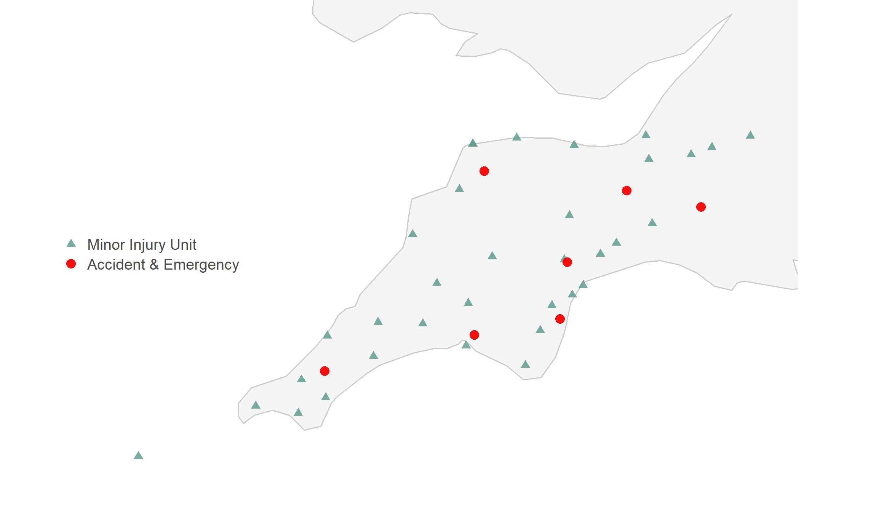
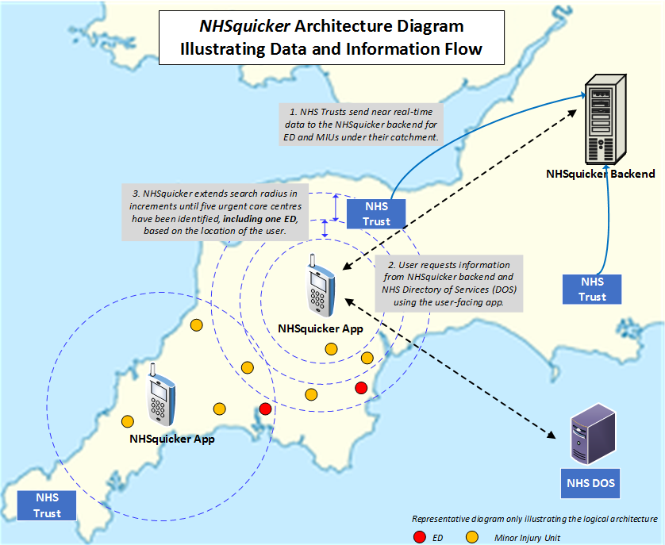

::: {style="display:flex; flex-wrap:wrap; gap:2rem; align-items:flex-start;"}

<!-- Left column: list of services -->

### Data sources {#data-sources}

Torbay & South Devon NHS Foundation Trust

- Torbay Hospital A&E
- Dawlish Hospital MIU (Not Live/Temp Closure)
- Newton Abbot Hospital MIU
- Totnes Hospital MIU

Royal Devon University Healthcare NHS Foundation Trust

- RD&E Hospital Wonford (A&E)
- North Devon District Hospital (A&E)
- Honiton Hospital MIU
- Bideford Hospital MIU (Not Live/Temp Closure)
- Ilfracombe Tyrrell Hospital MIU (Not Live/Temp Closure)
- Lynton Resource Centre MIU (Not Live/Temp Closure)
- Sidwell Street Walk-in Centre
- Exmouth MIU
- Okehampton MIU (Not Live)
- Ottery MIU (Not Live/Temp Closure)
- Ilfracombe Assessment and Treatment Centre (Not Live/Temp Closure)

Plymouth Hospitals NHS Trust

- Derriford Hospital (A&E)
- Tavistock MIU
- Kingsbridge MIU
- Cumberland Urgent Treatment Centre (formerly Plymouth MIU)

Royal Cornwall Hospitals NHS Trust

- Royal Cornwall Hospital Treliske (A&E)
- Bodmin MIU
- Camborne Redruth MIU
- Falmouth MIU
- Helston MIU
- Launceston MIU
- Liskeard MIU
- Newquay MIU
- St Austell MIU
- St Marys Isles of Scilly MIU
- Stratton MIU
- West Cornwall URGENT CARE CENTRE

Somerset NHS Foundation Trust

- Yeovil Hospital (A&E)
- Mushgrove Park Hospital (A&E)
- Bridgwater Urgent Treatment Centre
- Burnham on Sea MIU
- Chard Urgent Treatment Centre
- Frome Urgent Treatment Centre
- West Mendip (Glastonbury) Urgent Treatment Centre
- Minehead Urgent Treatment Centre
- Shepton Mallet Urgent Treatment Centre

South Western Ambulance Trust

- Tiverton Urgent Care Centre

<!-- Right column: map -->

{width="100%" alt="Map of NHSquicker service locations"}

:::

## Data process {#data-process}

## Limitations {#limitations-data}

limitations
