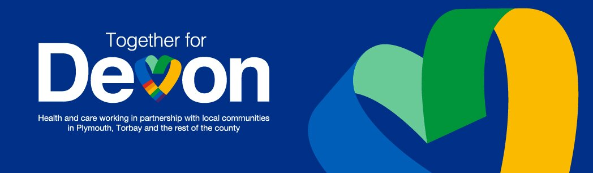
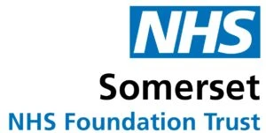
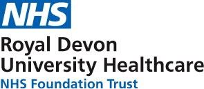

## External references and use

The app is referenced or used by NHS organisations and external bodies, including:

::: {.reference-item}
{.reference-logo}

::: {.reference-content}
**Together for Devon**  
A partnership of health and social care organisations working with local communities across Devon, Plymouth and Torbay. Mentions the app in a news article posted December 14, 2017.  

[View reference →](https://www.togetherfordevon.uk/new-nhs-app-devon-cornwall-helps-people-access-health-services-quicker)
:::
:::

::: {.reference-item}
{.reference-logo}

::: {.reference-content}
**NHS Torbay and South Devon**  
Mention of the app in their urgent and emergency care section of the website.  

[View reference →](https://www.torbayandsouthdevon.nhs.uk/services/urgent-and-emergency-care/nhsquicker/)
:::
:::

::: {.reference-item}
{.reference-logo}

::: {.reference-content}
**NHS Cornwall and Isles of Scilly**  
Mention of the app in their urgent and emergency care wait times section of the website. 

[View reference →](https://cios.icb.nhs.uk/help-us/waiting-times/)
:::
:::

::: {.reference-item}
{.reference-logo}

::: {.reference-content}
**NHS Somerset**  
Mention of the app in apps section of the website.

[View reference →](https://www.somersetft.nhs.uk/clinical-research/innovation/apps/nhs-quicker/)
:::
:::

::: {.reference-item}
{.reference-logo}

::: {.reference-content}
**NHS Royal Devon University Healthcare**  
Mention of the app in apps section of the website

[View reference →](https://www.royaldevon.nhs.uk/patients-visitors/apps/)
:::
:::

