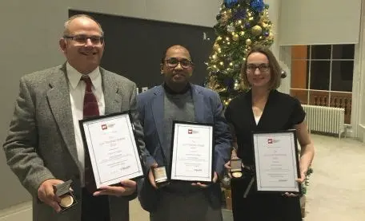
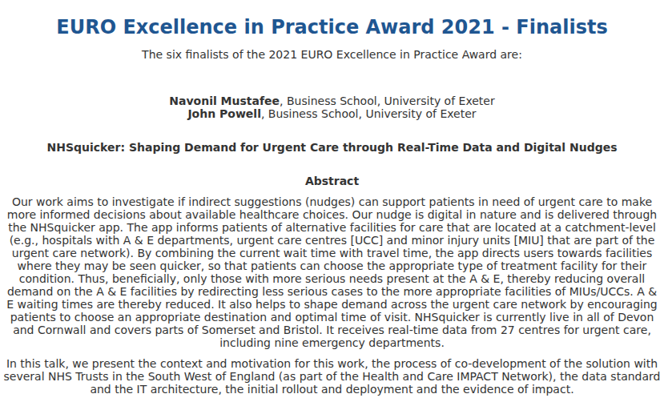
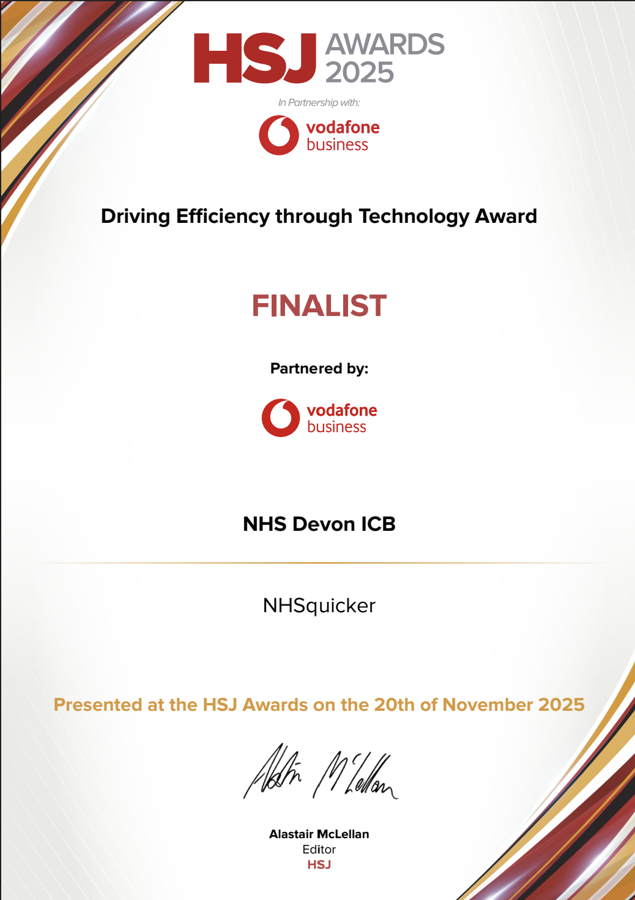
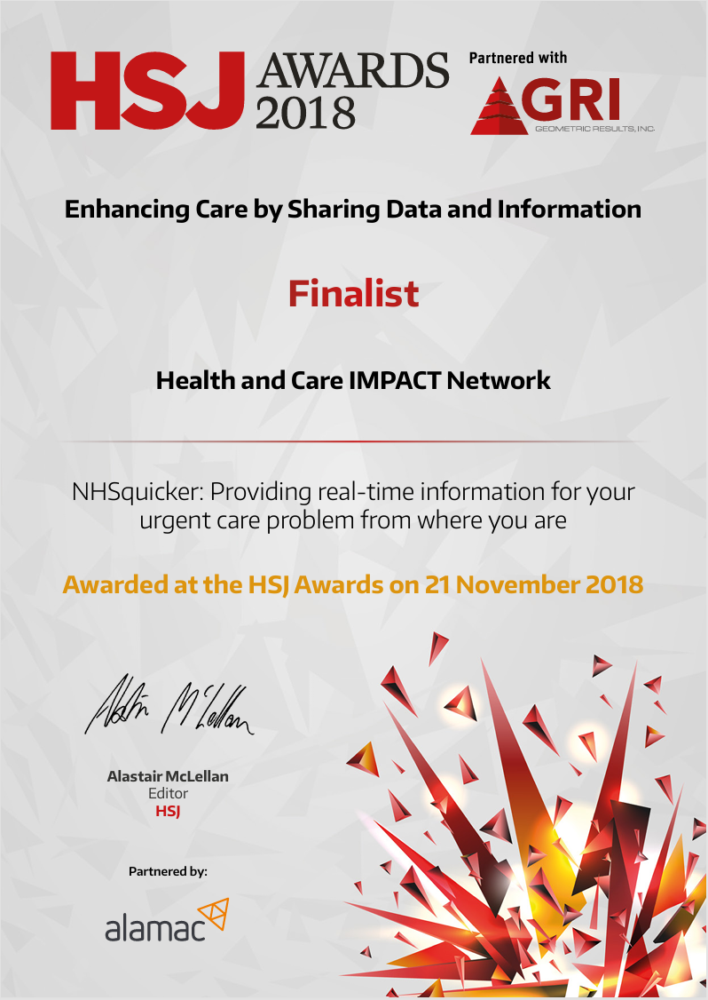
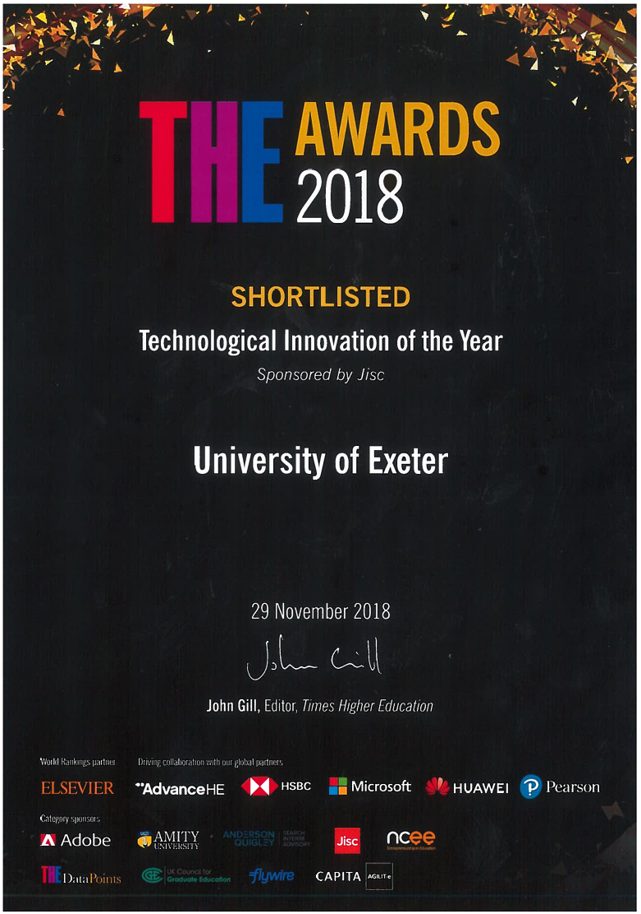

## Awards {#awards}

::: {layout-ncol="2"}
{target="_blank"}

{target="_blank"}

:::

::: {layout-ncol="3"}

:::

## News {#news}

NHSquicker has featured on BBC News.

::: {style="display:flex; justify-content:center; gap:30px; flex-wrap:wrap; margin:40px 0;"}
<video width="380" muted controls> <source src="images/NHSq_BBC%20spotlight_19th%20May-01.mp4" type="video/mp4"> </video>

<video width="380" muted controls> <source src="images/NHSquicker_BBC%20Spotlight_18th%20Dec%202017-01.mp4" type="video/mp4"> </video>
:::
